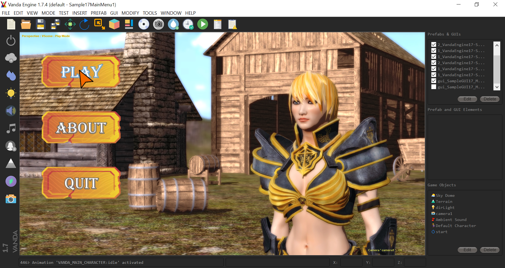

# vandaengine
**Summery**

Vanda Engine is a free and open source 3D game engine for Windows. I'm developing this game engine for years to help the students and other enthusiast learn game engine programming and develop 3D games for free. While giant companies are building game engines with huge budget and a lot of manpower, I'm developing this free 3D game engine in my room with a computer and no budget. 

I have published step by step tutorials about Vanda Engine, 3D tools, and COLLADA format:
https://vanda3d.org/tutorials/

Consider following Vanda Engine on Facebook to be informed about what I'm doing:
https://facebook.com/vandaengine

**License**

Files of this project use MIT license:

//Copyright (C) Ehsan Kamrani
//
This file is licensed and distributed under MIT license

For more information about MIT license, please visit http://opensource.org/licenses/MIT

**Compiler**

Microsoft Visual Studio 2013

**Compiling the source code**

https://vanda3d.org/compiling-the-source-code/

**Contact info**

opentechno@hotmail.com

**please buy me a cup of coffee**

It will be appreciated if you donate to this project to help me buy required software and books and pay the expenses of website domain and hosting. Thanks!

https://vanda3d.org/donate/

**Screenshot**

